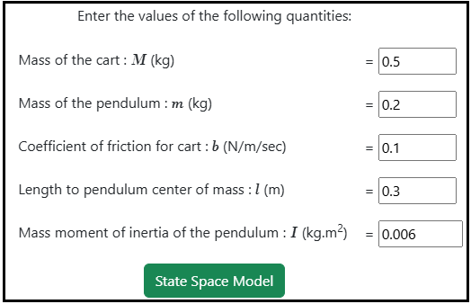
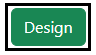
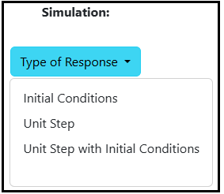

### Procedure

<b>Steps to perform the simulation</b>

<ol type="1">

<li> Enter the parameter values of the Inverted Pendulum on cart.</li> 

  
<b>Fig. 1. Parameter values of the Inverted pendulum on cart</b> 						  

 

<li> Click on 'State Space Model' button to get the state space form of the system.</li> 

            

 

  
<b>Fig. 2. Button to get the state Space form of the system</b> 							  

 

<li> Click on ' Enter the Pole Location' button to enter the desired pole values. </li> 

  
<b>Fig. 3. Button to enter the desired pole values </b> 						  

 

<li> Enter the desired pole values. </li> 

  
<b>Fig. 4. The desired pole values </b> 						  

 

<li> Click on 'Design' button for calculating the state feedback gain and pre-compensator gain values. </li> 

  
<b>Fig. 5. Button to calculate the state feedback and pre-compensator gain values </b> 						  

 

<li> Click on the 'Rank' or 'Determinant'  or "Inference' or ' Gain Values' buttons to get the the Controllability test information and gain values. </li> 

  
<b>Fig. 6. Rank, Determinant, Inference and Gain Values of the Controllability test and feedback gain with pre-compensator information </b> 						  

 

<li> Click on the 'Type of Response' dropdown button to select the required response in the simulation. </li>  

  
<b>Fig. 6. Selection of Response Type for Simulation </b> 						  

 

<li> Enter the required values and click on the 'Closed Loop Response' button to generate the plot.</li> 

  
<b>Fig. 7. Closed Loop Response button to get the plot </b> 						  

 

<li> <b>Note:</b> Enter the initial position value between -10 m to +10 m and enter the initial angle value between -6 &deg; to +6 &deg; (as per the practical experiment point of view). Click on the "Closed Loop Response" button.</li> 

<li> Click on 'Download' button to download the plot.</li> 

<li> Click on 'Clear' button to enter new parameter values for the system.</li>  

</ol>

