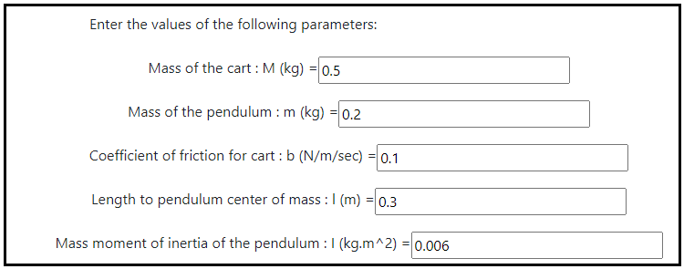
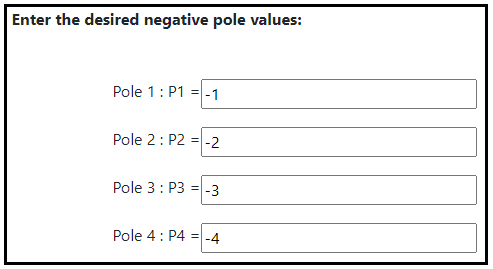
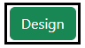
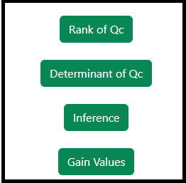

### Procedure

<b>Steps to perform the simulation</b>

										
1. Enter the parameter values of the Inverted Pendulum on cart.

<b>Fig. 1. Parameter values of the Inverted pendulum on cart</b>						  

2. Click on 'State Space Model' button to get the state space form of the system.

          

 

<b>Fig. 2. Button to get the state Space form of the system</b>							  

                        
3. Click on ' Enter the pole Location' button to enter the desired pole values. 

<b>Fig. 3. Button to enter the desired pole values </b>						  

4. Enter the desired pole values. 

<b>Fig. 4. The desired pole values </b> 						  

        

5. Click on 'Design' button for calculating the state feedback gain and pre-compensator gain values. 

<b>Fig. 5. Button to calculate the state feedback and pre-compensator gain values </b>

6. Click on the 'Rank' or 'Determinant'  or "inference' or ' Gain Values' buttons to get the the Controllability test information and gain values. 

<b>Fig. 6. Rank, determinant, inference and gain values of the Controllability test and feedback gain with pre-compensator information </b>						  

7. Click on 'Clear' button to enter the new parameter values of the system.

